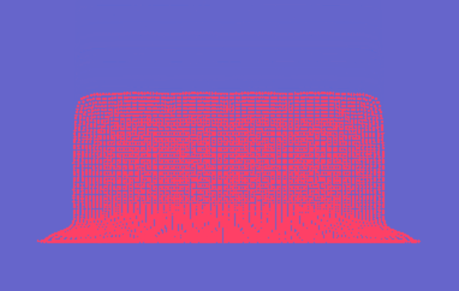

# Final Projects

<!--
Template:
{:class="img-final-projects"} (can also use gifs)
* [**Project Title**](project-link) -- [Team Member 1 Name](team-member-1-website), [Team Member 2 Name](team-member-2-website), [Team Member 2 Name](team-member-2-website)
-->

{:class="img-final-projects"}
* Team 1 Project

* [**Breakpoint**](https://github.com/dgerh/Breakpoint) -- [Daniel Gerhardt](https://www.linkedin.com/in/daniel-gerhardt-bb012722b/), [Dineth Meegoda](https://dinethmeegoda.com/), [Matt Schwartz](https://www.linkedin.com/in/matthew-schwartz-37019016b/), Zixiao Wang

{:class="img-final-projects"}
* [**Optisplat**: Optimizing the optimal gaussian splatting projection using CUDA and integrating with wide FOV SLAM.](https://github.com/rahulaggarwal965/cis5650-final-project) -- [Rahul Aggarwal](https://github.com/rahulaggarwal965), [Josh Smith](https://github.com/JoshMSmith44), [Mike Rabbitz](https://github.com/mrabbitz)

{:class="img-final-projects"}
* Team 4 Project

{:class="img-final-projects"}
* Team 5 Project

{:class="img-final-projects"}
* Team 6 Project

{:class="img-final-projects"}
* [**Nautilus Engine: Real-Time Ocean Rendering**](https://github.com/yuhanliu-tech/nautilus-engine) -- [Yuhan Liu](https://www.linkedin.com/in/yuhan-liu-/), [Joanna Fisch](https://www.linkedin.com/in/joanna-fisch-bb2979186/), [Nick Liu](https://www.linkedin.com/in/liunicholas6/?utm_source=share&utm_campaign=share_via&utm_content=profile&utm_medium=ios_app)

{:class="img-final-projects"}
* [**SurfelPlus: Real-time Global Illumination Based on Surfels**](https://github.com/WANG-Ruipeng/SurfelPlus) -- [Zhen Ren](https://github.com/ZhiQing-R), [Ruipeng Wang](https://github.com/WANG-Ruipeng), [Jinxiang Wang](https://github.com/JinxiangW)

{:class="img-final-projects"}
* [**World Space ReSTIR: Real-time GI Based on Hash Grids**](https://github.com/zhiyi1801/CIS-565-2024Fall-Final) -- [Zhiyi Zhou](https://github.com/zhiyi1801), [Jichu Mao](https://github.com/jichumao)

{:class="img-final-projects"}
* Team 10 Project

{:class="img-final-projects"}
* Team 11 Project

{:class="img-final-projects"}
* Team 12 Project

{:class="img-final-projects"}
* Team 13 Project

{:class="img-final-projects"}
* Team 14 Project
